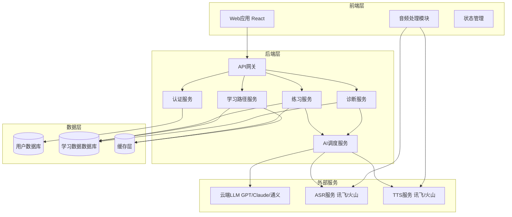
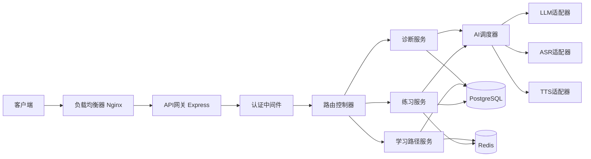
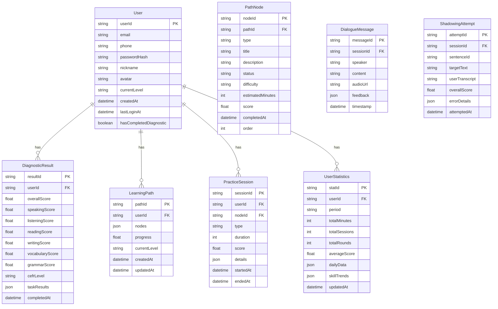

# 技术架构文档 - 多语种 AI 自适应语言学习平台 MVP

> 版本: v0.1
> 日期: 2026-07-21

---

## 1. 架构设计



---

## 2. 技术栈说明

### 2.1 前端技术栈

- **框架**: React 18.2+
- **构建工具**: Vite 5.0+
- **样式方案**: Tailwind CSS 3.4+
- **状态管理**: Zustand 4.5+ (轻量级,适合中等复杂度应用)
- **路由**: React Router 6.22+
- **音频处理**: Web Audio API + MediaRecorder API
- **图表库**: Recharts 2.12+ (用于数据可视化)
- **动画**: Framer Motion 11.0+
- **HTTP 客户端**: Axios 1.6+

### 2.2 后端技术栈

- **框架**: Node.js 18+ with Express 4.18+
- **认证**: JWT (jsonwebtoken 9.0+)
- **数据库 ORM**: Prisma 5.12+
- **数据库**: PostgreSQL 15+ (支持 JSON 字段,适合灵活的学习数据)
- **缓存**: Redis 7.0+ (用于会话管理和实时数据缓存)
- **文件存储**: 本地存储/Multer (用户录音临时存储)
- **WebSocket**: Socket.io 4.7+ (实时对话流式传输)

### 2.3 AI 服务集成

- **LLM**: OpenAI GPT-4o / Claude 3.5 Sonnet / 阿里通义千问 (通过 API 调用)
- **ASR**: 讯飞开放平台 / 火山引擎语音识别 API
- **TTS**: 讯飞开放平台 / 火山引擎语音合成 API

---

## 3. 路由定义

### 3.1 前端路由

| 路由路径 | 页面名称 | 权限要求 | 功能描述 |
|---------|---------|---------|---------|
| `/` | 首页重定向 | - | 自动跳转至登录页或学习路径页 |
| `/login` | 登录页 | 公开 | 用户登录/注册 |
| `/diagnostic` | 入学诊断页 | 需登录,首次访问 | 完成诊断任务 |
| `/path` | 学习路径页 | 需登录 | 展示学习路径和每日任务 |
| `/practice/dialogue` | 实时对话页 | 需登录 | AI对话练习 |
| `/practice/shadowing` | 跟读配音页 | 需登录 | 跟读打分练习 |
| `/profile` | 个人中心页 | 需登录 | 学习数据统计与设置 |

---

## 4. API 定义

### 4.1 认证相关 API

#### POST `/api/auth/register`
用户注册

**请求体**:
```typescript
interface RegisterRequest {
  phone?: string;      // 手机号(可选)
  email?: string;      // 邮箱(可选)
  password: string;    // 密码(最少8位)
  nickname?: string;   // 昵称
}
```

**响应体**:
```typescript
interface AuthResponse {
  success: boolean;
  data?: {
    userId: string;
    token: string;     // JWT token
    hasCompletedDiagnostic: boolean;
  };
  error?: string;
}
```

#### POST `/api/auth/login`
用户登录

**请求体**:
```typescript
interface LoginRequest {
  account: string;    // 手机号或邮箱
  password: string;
}
```

**响应体**: 同 `RegisterResponse`

---

### 4.2 诊断相关 API

#### GET `/api/diagnostic/tasks`
获取诊断任务列表

**响应体**:
```typescript
interface DiagnosticTasksResponse {
  success: boolean;
  data: {
    tasks: DiagnosticTask[];
  };
}

interface DiagnosticTask {
  taskId: string;
  type: 'speech' | 'text';  // 语音或文本任务
  content: {
    prompt: string;          // 任务提示
    target?: string;         // 跟读目标文本(语音任务)
    questions?: DiagnosticQuestion[]; // 选择/填空题(文本任务)
  };
  order: number;             // 任务顺序
}
```

#### POST `/api/diagnostic/submit`
提交诊断任务结果

**请求体**:
```typescript
interface SubmitDiagnosticRequest {
  taskId: string;
  type: 'speech' | 'text';
  response: {
    audioUrl?: string;       // 录音文件URL(语音任务)
    transcript?: string;     // ASR识别文本(语音任务)
    answers?: {              // 答案(文本任务)
      questionId: string;
      answer: string | string[];
    }[];
  };
}
```

**响应体**:
```typescript
interface SubmitDiagnosticResponse {
  success: boolean;
  data?: {
    taskScore: number;       // 本任务得分
    feedback?: string;       // 反馈
  };
  error?: string;
}
```

#### GET `/api/diagnostic/result`
获取诊断结果和能力画像

**响应体**:
```typescript
interface DiagnosticResultResponse {
  success: boolean;
  data: {
    profile: {
      overall: number;       // 总分
      speaking: number;      // 口语能力分
      listening: number;     // 听力能力分
      reading: number;       // 阅读能力分
      writing: number;       // 写作能力分
      vocabulary: number;    // 词汇量级
      grammar: number;       // 语法掌握度
    };
    level: 'A1' | 'A2' | 'B1' | 'B2' | 'C1' | 'C2';  // CEFR等级
    recommendation: string;  // 学习建议
  };
}
```

---

### 4.3 学习路径相关 API

#### GET `/api/path`
获取用户学习路径

**响应体**:
```typescript
interface LearningPathResponse {
  success: boolean;
  data: {
    pathId: string;
    nodes: PathNode[];
    progress: number;        // 整体进度百分比
    currentLevel: string;    // 当前等级
  };
}

interface PathNode {
  nodeId: string;
  type: 'vocabulary' | 'dialogue' | 'shadowing' | 'grammar';
  title: string;
  description: string;
  status: 'locked' | 'available' | 'in_progress' | 'completed';
  difficulty: 'easy' | 'medium' | 'hard';
  estimatedMinutes: number;
  completedAt?: string;
  score?: number;
}
```

#### GET `/api/path/daily-tasks`
获取今日推荐任务

**查询参数**:
- `date`: 日期(YYYY-MM-DD),可选,默认今天

**响应体**:
```typescript
interface DailyTasksResponse {
  success: boolean;
  data: {
    tasks: DailyTask[];
    totalMinutes: number;    // 预计总时长
    completedTasks: number;  // 已完成任务数
  };
}

interface DailyTask {
  taskId: string;
  nodeId: string;
  title: string;
  type: 'vocabulary' | 'dialogue' | 'shadowing';
  difficulty: 'easy' | 'medium' | 'hard';
  estimatedMinutes: number;
  status: 'pending' | 'completed';
  score?: number;
}
```

---

### 4.4 练习相关 API

#### POST `/api/practice/dialogue/start`
开始对话练习

**请求体**:
```typescript
interface StartDialogueRequest {
  nodeId: string;
  sceneId: string;           // 场景ID
  difficulty: 'easy' | 'medium' | 'hard';
}
```

**响应体**:
```typescript
interface StartDialogueResponse {
  success: boolean;
  data: {
    sessionId: string;
    scene: {
      name: string;
      description: string;
    };
    greeting: string;        // AI开场白
  };
}
```

#### POST `/api/practice/dialogue/message`
发送对话消息(实时)

**请求体**:
```typescript
interface DialogueMessageRequest {
  sessionId: string;
  audioUrl: string;          // 录音文件URL
  transcript: string;        // ASR识别文本
}
```

**响应体**:
```typescript
interface DialogueMessageResponse {
  success: boolean;
  data: {
    aiResponse: string;      // AI回复文本
    audioUrl: string;        // AI回复音频URL
    feedback?: {             // 实时反馈(可选)
      grammarErrors: string[];
      suggestions: string[];
    };
  };
}
```

#### POST `/api/practice/dialogue/end`
结束对话练习

**请求体**:
```typescript
interface EndDialogueRequest {
  sessionId: string;
}
```

**响应体**:
```typescript
interface EndDialogueResponse {
  success: boolean;
  data: {
    rounds: number;          // 对话轮次
    duration: number;        // 时长(秒)
    score: number;           // 本次练习评分
    vocabulary: string[];    // 使用的关键词汇
    improvements: string[];  // 改进建议
  };
}
```

#### POST `/api/practice/shadowing/start`
开始跟读练习

**请求体**:
```typescript
interface StartShadowingRequest {
  nodeId: string;
  sentenceId: string;
}
```

**响应体**:
```typescript
interface StartShadowingResponse {
  success: boolean;
  data: {
    sentence: {
      text: string;
      translation: string;
      audioUrl: string;      // 标准发音音频
      difficulty: 'easy' | 'medium' | 'hard';
    };
  };
}
```

#### POST `/api/practice/shadowing/submit`
提交跟读录音

**请求体**:
```typescript
interface SubmitShadowingRequest {
  sentenceId: string;
  audioUrl: string;          // 用户录音URL
  transcript: string;        // ASR识别文本
}
```

**响应体**:
```typescript
interface SubmitShadowingResponse {
  success: boolean;
  data: {
    overallScore: number;    // 总分(0-100)
    pronunciation: number;   // 发音准确度
    fluency: number;         // 流利度
    intonation: number;      // 语调
    errors: {                // 错误详情
      word: string;
      expected: string;
      actual: string;
      phonemes: string[];    // 错误音素
    }[];
    suggestion: string;      // 改进建议
  };
}
```

---

### 4.5 用户数据相关 API

#### GET `/api/user/profile`
获取用户个人资料

**响应体**:
```typescript
interface UserProfileResponse {
  success: boolean;
  data: {
    userId: string;
    nickname: string;
    email?: string;
    phone?: string;
    avatar?: string;
    createdAt: string;
    level: string;
    totalPracticeMinutes: number;
    totalSessions: number;
    averageScore: number;
  };
}
```

#### GET `/api/user/statistics`
获取学习统计数据

**查询参数**:
- `period`: 时间范围(`week` | `month` | `all`)

**响应体**:
```typescript
interface UserStatisticsResponse {
  success: boolean;
  data: {
    period: string;
    totalMinutes: number;
    totalSessions: number;
    totalRounds: number;
    averageScore: number;
    dailyData: {             // 每日数据
      date: string;
      minutes: number;
      sessions: number;
      score: number;
    }[];
    skillTrends: {           // 能力趋势
      date: string;
      speaking: number;
      listening: number;
      reading: number;
      writing: number;
    }[];
  };
}
```

---

## 5. 服务器架构图



---

## 6. 数据模型

### 6.1 数据模型定义



### 6.2 数据定义语言 (DDL)

#### 用户表 (users)
```sql
CREATE TABLE users (
    user_id VARCHAR(36) PRIMARY KEY DEFAULT (UUID()),
    email VARCHAR(255) UNIQUE,
    phone VARCHAR(20) UNIQUE,
    password_hash VARCHAR(255) NOT NULL,
    nickname VARCHAR(100),
    avatar VARCHAR(500),
    current_level VARCHAR(10) DEFAULT 'A1',
    has_completed_diagnostic BOOLEAN DEFAULT FALSE,
    created_at TIMESTAMP DEFAULT CURRENT_TIMESTAMP,
    last_login_at TIMESTAMP,
    updated_at TIMESTAMP DEFAULT CURRENT_TIMESTAMP ON UPDATE CURRENT_TIMESTAMP
);

CREATE INDEX idx_users_email ON users(email);
CREATE INDEX idx_users_phone ON users(phone);
CREATE INDEX idx_users_level ON users(current_level);
```

#### 诊断结果表 (diagnostic_results)
```sql
CREATE TABLE diagnostic_results (
    result_id VARCHAR(36) PRIMARY KEY DEFAULT (UUID()),
    user_id VARCHAR(36) NOT NULL,
    overall_score DECIMAL(5,2),
    speaking_score DECIMAL(5,2),
    listening_score DECIMAL(5,2),
    reading_score DECIMAL(5,2),
    writing_score DECIMAL(5,2),
    vocabulary_score DECIMAL(5,2),
    grammar_score DECIMAL(5,2),
    cefr_level VARCHAR(5),
    task_results JSON,
    completed_at TIMESTAMP DEFAULT CURRENT_TIMESTAMP,
    FOREIGN KEY (user_id) REFERENCES users(user_id) ON DELETE CASCADE
);

CREATE INDEX idx_diagnostic_user ON diagnostic_results(user_id);
CREATE INDEX idx_diagnostic_level ON diagnostic_results(cefr_level);
```

#### 学习路径表 (learning_paths)
```sql
CREATE TABLE learning_paths (
    path_id VARCHAR(36) PRIMARY KEY DEFAULT (UUID()),
    user_id VARCHAR(36) NOT NULL UNIQUE,
    progress DECIMAL(5,2) DEFAULT 0,
    current_level VARCHAR(10),
    created_at TIMESTAMP DEFAULT CURRENT_TIMESTAMP,
    updated_at TIMESTAMP DEFAULT CURRENT_TIMESTAMP ON UPDATE CURRENT_TIMESTAMP,
    FOREIGN KEY (user_id) REFERENCES users(user_id) ON DELETE CASCADE
);

CREATE INDEX idx_path_user ON learning_paths(user_id);
```

#### 路径节点表 (path_nodes)
```sql
CREATE TABLE path_nodes (
    node_id VARCHAR(36) PRIMARY KEY DEFAULT (UUID()),
    path_id VARCHAR(36) NOT NULL,
    node_type ENUM('vocabulary', 'dialogue', 'shadowing', 'grammar') NOT NULL,
    title VARCHAR(200) NOT NULL,
    description TEXT,
    status ENUM('locked', 'available', 'in_progress', 'completed') DEFAULT 'locked',
    difficulty ENUM('easy', 'medium', 'hard') DEFAULT 'medium',
    estimated_minutes INT DEFAULT 15,
    score DECIMAL(5,2),
    completed_at TIMESTAMP,
    node_order INT NOT NULL,
    created_at TIMESTAMP DEFAULT CURRENT_TIMESTAMP,
    FOREIGN KEY (path_id) REFERENCES learning_paths(path_id) ON DELETE CASCADE
);

CREATE INDEX idx_node_path ON path_nodes(path_id);
CREATE INDEX idx_node_status ON path_nodes(status);
```

#### 练习会话表 (practice_sessions)
```sql
CREATE TABLE practice_sessions (
    session_id VARCHAR(36) PRIMARY KEY DEFAULT (UUID()),
    user_id VARCHAR(36) NOT NULL,
    node_id VARCHAR(36),
    session_type ENUM('dialogue', 'shadowing') NOT NULL,
    duration INT DEFAULT 0,
    score DECIMAL(5,2),
    details JSON,
    started_at TIMESTAMP DEFAULT CURRENT_TIMESTAMP,
    ended_at TIMESTAMP,
    FOREIGN KEY (user_id) REFERENCES users(user_id) ON DELETE CASCADE
);

CREATE INDEX idx_session_user ON practice_sessions(user_id);
CREATE INDEX idx_session_node ON practice_sessions(node_id);
CREATE INDEX idx_session_type ON practice_sessions(session_type);
```

#### 对话消息表 (dialogue_messages)
```sql
CREATE TABLE dialogue_messages (
    message_id VARCHAR(36) PRIMARY KEY DEFAULT (UUID()),
    session_id VARCHAR(36) NOT NULL,
    speaker ENUM('user', 'ai') NOT NULL,
    content TEXT NOT NULL,
    audio_url VARCHAR(500),
    feedback JSON,
    timestamp TIMESTAMP DEFAULT CURRENT_TIMESTAMP,
    FOREIGN KEY (session_id) REFERENCES practice_sessions(session_id) ON DELETE CASCADE
);

CREATE INDEX idx_message_session ON dialogue_messages(session_id);
```

#### 跟读尝试表 (shadowing_attempts)
```sql
CREATE TABLE shadowing_attempts (
    attempt_id VARCHAR(36) PRIMARY KEY DEFAULT (UUID()),
    session_id VARCHAR(36) NOT NULL,
    sentence_id VARCHAR(36) NOT NULL,
    target_text TEXT NOT NULL,
    user_transcript TEXT,
    overall_score DECIMAL(5,2),
    error_details JSON,
    attempted_at TIMESTAMP DEFAULT CURRENT_TIMESTAMP,
    FOREIGN KEY (session_id) REFERENCES practice_sessions(session_id) ON DELETE CASCADE
);

CREATE INDEX idx_attempt_session ON shadowing_attempts(session_id);
```

#### 用户统计表 (user_statistics)
```sql
CREATE TABLE user_statistics (
    stat_id VARCHAR(36) PRIMARY KEY DEFAULT (UUID()),
    user_id VARCHAR(36) NOT NULL,
    period ENUM('week', 'month', 'all') NOT NULL,
    total_minutes INT DEFAULT 0,
    total_sessions INT DEFAULT 0,
    total_rounds INT DEFAULT 0,
    average_score DECIMAL(5,2) DEFAULT 0,
    daily_data JSON,
    skill_trends JSON,
    updated_at TIMESTAMP DEFAULT CURRENT_TIMESTAMP ON UPDATE CURRENT_TIMESTAMP,
    FOREIGN KEY (user_id) REFERENCES users(user_id) ON DELETE CASCADE,
    UNIQUE KEY unique_user_period (user_id, period)
);

CREATE INDEX idx_stats_user ON user_statistics(user_id);
```

---

## 7. 实时通信设计

### 7.1 WebSocket 事件

用于实时对话场景,减少 HTTP 轮询开销。

**客户端发送事件**:
- `start_recording`: 开始录音
- `audio_data`: 音频数据流(分片上传)
- `stop_recording`: 停止录音

**服务器发送事件**:
- `transcript`: 实时转录文本
- `ai_response`: AI 回复文本(流式)
- `ai_audio`: AI 音频流
- `feedback`: 实时语法反馈

### 7.2 性能优化策略

- **音频压缩**: 前端使用 Opus 编码,降低传输大小
- **流式传输**: ASR/TTS 采用流式接口,边录边识别
- **缓存策略**: 常用场景对话模板缓存在 Redis,减少 LLM 调用
- **预加载**: 用户进入对话页面前预加载场景信息

---

## 8. 安全与合规

### 8.1 数据安全

- 用户密码使用 bcrypt 加密存储
- JWT token 有效期 7 天,刷新机制
- HTTPS 全站加密传输
- 敏感操作二次验证

### 8.2 语音数据合规

- 首次使用语音功能需用户明确授权
- 录音数据临时存储 30 天后自动删除
- 使用国内 ASR/TTS 服务商,符合监管要求
- 用户可在个人中心撤回授权

---

## 9. 监控与运维

### 9.1 监控指标

- API 响应时间(P50/P95/P99)
- 错误率
- AI 服务调用成功率与延迟
- 数据库查询性能
- WebSocket 连接数

### 9.2 日志记录

- 用户行为日志(登录、练习、完成节点)
- 错误日志(带堆栈跟踪)
- AI 调用日志(请求/响应/耗时)
- 性能日志(慢查询、慢接口)

---

## 10. 扩展性设计

### 10.1 多语种扩展

- 数据模型预留 `language` 字段
- LLM/Audio 服务抽象为适配器模式,支持多厂商切换
- 内容生成模板支持多语种参数

### 10.2 AI 服务降级

- 主 LLM 不可用时自动切换备选服务商
- ASR/TTS 多厂商配置,失败自动重试其他厂商
- 本地缓存常用对话模板,极端情况下提供离线练习

---

## 11. 技术风险与应对

| 风险 | 影响 | 应对措施 |
|------|------|---------|
| AI 服务响应慢 | 对话体验差 | 流式响应、超时降级、预生成回复 |
| ASR 识别准确率低 | 跟读评分不准 | 多次采样、语音增强、人工标注优化 |
| WebSocket 连接不稳定 | 实时对话中断 | 自动重连机制、HTTP 轮询降级 |
| 数据库性能瓶颈 | 查询慢、响应超时 | 读写分离、索引优化、缓存热点数据 |