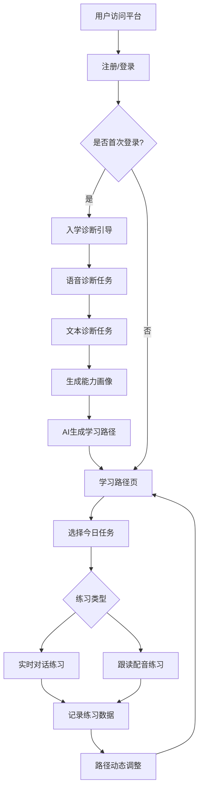

# 产品需求文档 (PRD) - 多语种 AI 自适应语言学习平台 MVP

> 版本: v0.1
> 日期: 2026-07-21
> 状态: 需求梳理完成

---

## 1. 产品概述

多语种 AI 自适应语言学习平台是一款面向中国 K12 及大学生的 Web 端英语学习产品,通过 AI 自适应诊断生成个性化学习路径,以听说实用能力为导向,提供实时语音对话和跟读配音练习,动态调整学习内容。

**核心价值**: 解决传统大班课"一刀切"问题,让每个学生按自己的水平起步、按自己的节奏推进听说训练,摆脱"能考试但不会说"的困境。

---

## 2. 核心功能

### 2.1 用户角色

| 角色 | 注册方式 | 核心权限 |
|------|----------|----------|
| 普通学员 | 手机号注册/邮箱注册 | 完成诊断、查看路径、进行练习、查看学习数据 |

### 2.2 功能模块

根据 MVP 核心流程,系统包含以下核心页面:

1. **登录注册页**: 账号体系、用户信息收集
2. **入学诊断页**: 语音/文本任务、能力画像输出
3. **学习路径页**: 个性化路径展示、每日任务、进度跟踪
4. **实时对话页**: AI 对话练习、语境模拟、即时反馈
5. **跟读配音页**: 句子展示、录音打分、发音纠正
6. **个人中心页**: 学习数据统计、历史记录、设置管理

### 2.3 页面详情

| 页面名称 | 模块名称 | 功能描述 |
|---------|---------|---------|
| 登录注册页 | 注册模块 | 手机号/邮箱注册,密码设置,验证码校验 |
| 登录注册页 | 登录模块 | 账号密码登录,第三方登录预留接口 |
| 入学诊断页 | 诊断引导 | 展示诊断流程说明,任务指引 |
| 入学诊断页 | 语音诊断任务 | ASR 识别用户朗读内容,评估发音与流利度 |
| 入学诊断页 | 文本诊断任务 | 展示题目,接收用户回答,评估语法与词汇水平 |
| 入学诊断页 | 能力画像输出 | 展示听说读写各项能力评分,生成初始学习路径 |
| 学习路径页 | 路径可视化 | 展示个性化学习路径节点(词汇/对话/跟读等) |
| 学习路径页 | 每日任务卡片 | 推荐当日学习任务,一键进入练习 |
| 学习路径页 | 进度跟踪 | 展示已完成/进行中/待解锁节点,整体进度百分比 |
| 实时对话页 | 场景选择 | 选择对话场景(日常/校园/旅游等),难度等级 |
| 实时对话页 | AI 对话界面 | ASR 实时识别用户语音 → LLM 生成回复 → TTS 播放 |
| 实时对话页 | 对话记录 | 展示历史对话内容,关键表达标注 |
| 实时对话页 | 实时反馈 | 语法纠正提示,表达建议 |
| 跟读配音页 | 句子展示 | 展示目标句子/场景对话,音频播放按钮 |
| 跟读配音页 | 录音模块 | 用户跟读录音,ASR 识别内容 |
| 跟读配音页 | 打分反馈 | 发音准确度评分,错误音素高亮,纠正建议 |
| 个人中心页 | 学习统计 | 总学习时长,练习轮次,发音平均分,能力趋势图 |
| 个人中心页 | 历史记录 | 按日期展示练习历史,可回放对话与录音 |
| 个人中心页 | 设置管理 | 个人信息修改,语音数据授权,通知设置 |

---

## 3. 核心流程

### 3.1 新用户激活流程

用户首次进入平台 → 完成注册登录 → 进入入学诊断 → 完成语音+文本诊断任务 → 系统生成能力画像 → AI 生成个性化学习路径 → 展示学习路径页 → 用户查看每日任务

### 3.2 学习练习流程

用户登录 → 查看学习路径页 → 选择今日任务 → 进入对应练习页面(对话/跟读) → 完成练习 → 系统记录数据 → 路径动态调整 → 更新学习进度

### 3.3 流程图

---

## 4. 用户界面设计

### 4.1 设计风格

**设计理念**: 清新现代的教育科技风格,融合沉浸式学习体验与专业感,避免过度娱乐化。

- **主色调**: 柔和蓝绿色系(#0EA5E9 主题蓝 + #10B981 辅助绿),传达科技感与成长感
- **辅助色**: 温暖的橙色(#F59E0B)用于强调重点,中性灰(#6B7280)用于文字
- **按钮风格**: 圆角按钮(8px),微渐变背景,hover 状态有轻微阴影提升
- **字体**:
  - 中文: 思源黑体(Source Han Sans)作为主字体,清晰易读
  - 英文: Nunito 字体用于标题,Roboto 用于正文,兼顾现代感与可读性
  - 字号: 标题 24-32px,正文 16px,辅助文字 14px
- **布局风格**: 卡片式布局,左侧导航栏固定,右侧内容区滚动,网格间距 24px
- **图标风格**: 简洁线条图标,配合品牌色,避免过度装饰
- **动效**: 页面切换淡入淡出,卡片 hover 微微上浮,对话气泡依次滑入,打分结果弹出动画

### 4.2 页面设计概览

| 页面名称 | 模块名称 | UI 元素 |
|---------|---------|---------|
| 登录注册页 | 整体布局 | 居中卡片布局,左侧品牌展示区,右侧表单区,背景渐变蓝绿 |
| 登录注册页 | 表单区 | 输入框带图标,圆角边框,错误提示红色小字,提交按钮全宽 |
| 入学诊断页 | 整体布局 | 顶部进度条,中部任务展示区,底部操作按钮,向导式布局 |
| 入学诊断页 | 语音任务区 | 大麦克风图标,波形动画提示录音中,实时文字显示识别结果 |
| 入学诊断页 | 能力画像 | 雷达图展示听说读写能力,各维度分数标注,能力描述卡片 |
| 学习路径页 | 整体布局 | 左侧树形/时间线路径图,右侧每日任务推荐卡片,顶部进度统计 |
| 学习路径页 | 路径节点 | 圆形节点,完成状态绿色对勾,进行中蓝色环,待解锁灰色锁图标 |
| 学习路径页 | 任务卡片 | 白色卡片,图标+标题+时长+难度标签,hover 阴影,点击动画 |
| 实时对话页 | 整体布局 | 顶部场景信息,中部对话流式展示区,底部语音输入控件 |
| 实时对话页 | 对话气泡 | AI 气泡左侧灰色背景,用户气泡右侧蓝色背景,时间戳小字 |
| 实时对话页 | 录音控件 | 大圆形录音按钮,按下时脉冲动画,音量波形实时显示 |
| 跟读配音页 | 整体布局 | 上部目标句子展示,中部录音区,下部打分结果 |
| 跟读配音页 | 打分结果 | 环形进度条显示总分,错误单词红色下划线,纠正建议卡片 |
| 个人中心页 | 整体布局 | 顶部用户信息卡片,中部数据统计图表,下部功能列表 |
| 个人中心页 | 统计图表 | 折线图展示能力趋势,柱状图展示每周学习时长,数据卡片 |

### 4.3 响应式设计

- **桌面优先**: 设计以桌面端为主,建议最小宽度 1024px,推荐 1440px
- **移动适配**:
  - 导航栏在小屏幕转为底部 tab 栏
  - 卡片布局由多列转为单列
  - 字号和间距略微缩小
  - 录音按钮放大方便触摸操作
- **触摸优化**: 移动端录音按钮加大至 80px,滑动操作流畅,点击区域充足

### 4.4 特殊场景设计

**语音交互状态反馈**:
- 录音中: 麦克风图标周围显示脉冲动画,实时音量波形
- 识别中: 文字逐字淡入显示,加载动画
- AI 思考中: 对话气泡显示"思考中..."动画
- 播放中: 播放图标动画,时间进度条

**诊断结果展示**:
- 能力雷达图: 六边形雷达图,各顶点标注维度名称,填充色渐变
- 分数动画: 数字从 0 跳动到实际分数,配合缓动函数
- 路径节点动画: 节点依次点亮,连接线绘制动画

---

## 5. 成功标准

### 5.1 MVP 核心指标

| 指标 | 定义 | MVP 目标 |
|------|------|---------|
| **激活率** | 注册用户中完成诊断并生成首条学习路径的比例 | ≥ 60% |
| **学习参与度** | 激活用户人均周学习时长 / 周完成练习对话轮次 | 周时长 ≥ 60 分钟,或周完成轮次 ≥ 20 |

### 5.2 参考观察指标

- 7 日留存率
- 30 日留存率
- 路径节点完成率
- 单次对话平均轮次
- 跟读练习完成率

---

## 6. Non-goals (明确不做的事)

- ❌ 社交/社区功能: 好友、排行榜、论坛、打卡分享
- ❌ 应试真题库与模考: 不接入四六级等真题
- ❌ 原生 App 与小程序: 仅 Web 端
- ❌ 真人外教直播/约课: AI 对话为主
- ❌ 自研大模型/语音引擎: 依赖第三方服务
- ❌ 日语/韩语语种: 仅英语,MVP 后扩展

---

## 7. 未来路线图

- **v0.2**: 增加学习报告导出,家长监督账号
- **v0.3**: 扩展日语、韩语语种支持
- **v0.4**: 接入更多 AI 模型供应商,优化成本
- **v1.0**: 完善付费订阅体系,增加高级功能